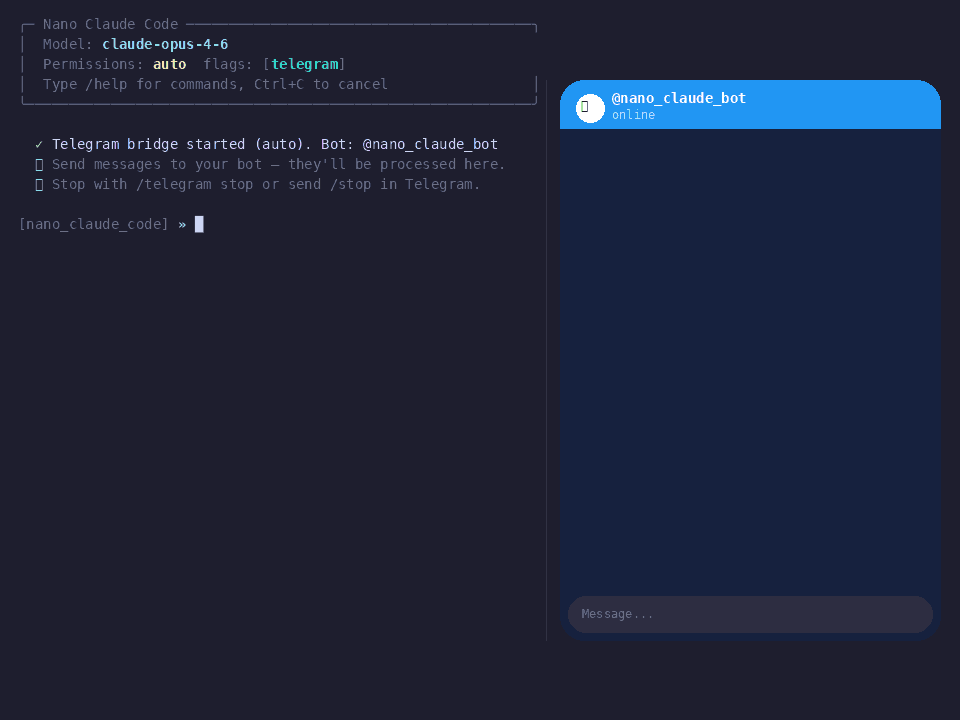
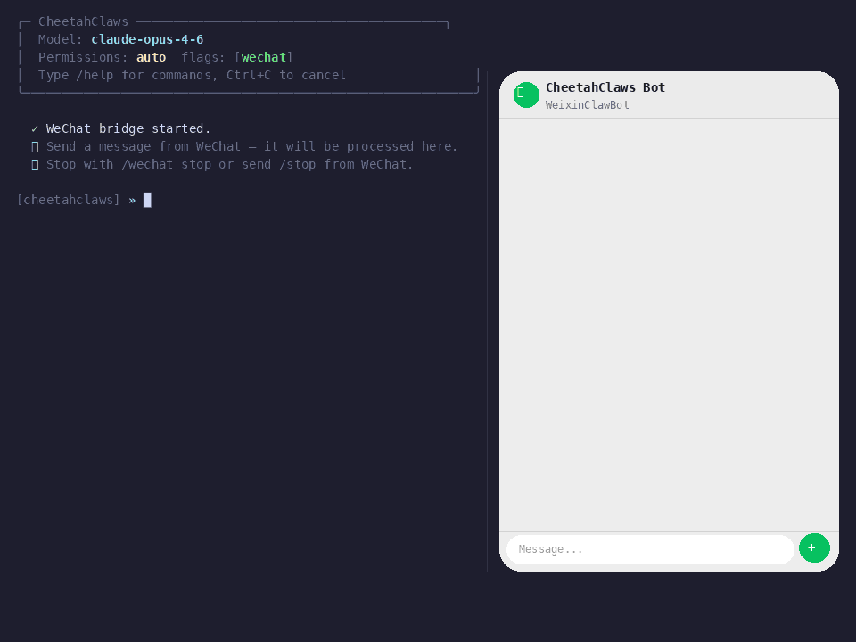
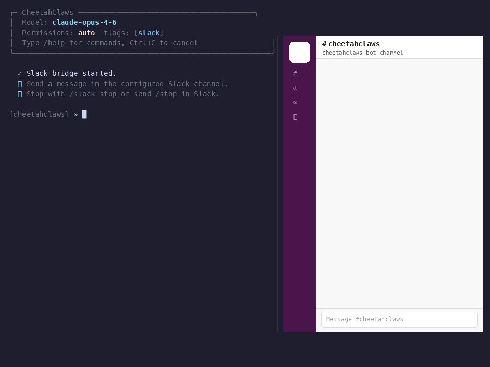

# Bridges — Telegram, WeChat, Slack

## Telegram Bridge

`/telegram` turns cheetahclaws into a Telegram bot — receive messages from your phone, run the model with full tool access, and reply automatically.

<div align=center>

</div>

### Setup (one-time)

1. Open [@BotFather](https://t.me/BotFather) in Telegram → `/newbot` → copy the token.
2. Send any message to your new bot (e.g. "hi"), then open the URL below in your browser — replace `<TOKEN>` with your real token:

```
https://api.telegram.org/bot<TOKEN>/getUpdates
```

The response is JSON. Find `"chat"` → `"id"` — that number is your chat ID:

```json
{
  "ok": true,
  "result": [
    {
      "update_id": 100000001,
      "message": {
        "from": { "id": 987654321, "first_name": "Zhang" },
        "chat": {
          "id": 987654321,
          "type": "private"
        },
        "text": "hi"
      }
    }
  ]
}
```

> **Tip:** if `result` is empty, go back to Telegram, send another message to your bot, then refresh the URL.

3. Configure cheetahclaws (example with the values above):

```
[myproject] ❯ /telegram 7812345678:AAFxyz123abcDEF456ghiJKL789 987654321
  ✓ Telegram config saved.
  ✓ Connected to @your_bot_name. Starting bridge...
  ✓ Telegram bridge active. Chat ID: 987654321
  ℹ Send messages to your bot — they'll be processed here.
  ℹ Stop with /telegram stop or send /stop in Telegram.
```

Token and chat_id are saved to `~/.cheetahclaws/config.json`. On next launch the bridge **auto-starts** if configured — the startup banner shows `flags: [telegram]`.

### How it works

```
Phone (Telegram)                  cheetahclaws terminal
──────────────────                ──────────────────────────
"List Python files"      →        📩 Telegram: List Python files
                                  [typing indicator sent...]
                                  ⚙ Glob(**/*.py) → 5 files
                                  ⚙ response assembled
                          ←       "agent.py, tools.py, ..."
```

- **Typing indicator** is sent every 4 seconds while the model processes, so the chat feels responsive.
- **Unauthorized senders** receive `⛔ Unauthorized.` and their messages are dropped.
- **Slash command passthrough**: send `/cost`, `/model gpt-4o`, `/clear`, `/monitor`, `/agent`, etc. from Telegram and they execute in cheetahclaws.
- **Interactive menus over Telegram**: commands with interactive prompts (e.g. `/monitor` wizard, `/agent` wizard, `/permission`, `/checkpoint`) run in a background thread. The menu is sent as a Telegram message; your next reply is used as the selection.
- **Job queue & remote control**: `!jobs` / `!job <id>` / `!retry <id>` / `!cancel` — see [Remote Control](#remote-control-phone--computer).
- **`/stop` or `/off`** sent from Telegram stops the bridge gracefully.

### Photo & Voice support

You can send photos and voice messages directly to the bot — no extra commands needed.

**Photos**

Send any photo (with or without a caption). CheetahClaws downloads the highest-resolution version, encodes it as Base64, and passes it to the active vision model alongside the caption text. If no caption is provided, the default prompt is `"What do you see in this image? Describe it in detail."`.

> **Requirement:** the active model must support vision (e.g. `claude-opus-4-6`, `gpt-4o`, `gemini-2.0-flash`, or any Ollama vision model such as `llava`). Use `/model` to switch if needed.

**Voice messages & audio files**

Send a voice note (OGG) or audio file (MP3). CheetahClaws transcribes it automatically and submits the transcript as your next query. The transcription is echoed back to the chat before the model responds.

> **Requirements:**
> - **`ffmpeg`** must be installed for audio conversion (`sudo apt install ffmpeg` / `brew install ffmpeg`).
> - At least one STT backend must be available (tried in order):
>   1. `faster-whisper` — `pip install faster-whisper` (local, offline, recommended)
>   2. `openai-whisper` — `pip install openai-whisper` (local, offline)
>   3. OpenAI Whisper API — set `OPENAI_API_KEY` (cloud fallback, requires internet)
>
> If `ffmpeg` is missing, voice messages will fail with `⚠ Could not download voice message.`

### Permission prompts (clickable buttons & numbered menus) (#84)

When the model wants to run a write/edit/Bash tool and `permission_mode` isn't `accept-all`, cheetahclaws asks for approval. The prompt is now rendered with an interactive picker on **every** channel — pick the form that fits the medium:

| Channel | UX |
|---|---|
| **Telegram** | Real `inline_keyboard` with `✅ Approve` / `❌ Reject` / `✅✅ Accept all` buttons. Tap → ack via `answerCallbackQuery` (spinner clears), original message edited to append `✓ Selected: y` for scroll-back, agent thread resumes. Stale-click protection via per-prompt `prompt_id` baked into `callback_data`. |
| **Slack** | Numbered menu rendered into the message body. Reply with the digit (`1`/`2`/`3`), the canonical letter (`y`/`n`/`a`), or a label word (`approve` / `reject` / `accept` / `all`) — all three resolve to the same value before the caller sees them. |
| **WeChat** | Same numbered-menu UX as Slack. Header is `❓ 需要输入`; reply with digit / letter / label word, all resolved server-side. |
| **Terminal** | Numbered menu printed above the input cursor; same digit / letter / label-word reply normalization. |
| **Web (chat API)** | Existing browser approval UI handles this — untouched. |

The reply normalization is shared: `_resolve_choice("1", value_map) == "y"`, `_resolve_choice("approve", value_map) == "y"`, `_resolve_choice("custom answer", value_map) == "custom answer"` (unknown replies pass through verbatim, so callers that combine `options=` with free-text questions still work).

```
❓ Input Required
Allow: Bash 'rm -rf /tmp/scratch'  [y/N/a(ccept-all)]

  [1] ✅ Approve  (reply `1` or `y`)
  [2] ❌ Reject  (reply `2` or `n`)
  [3] ✅✅ Accept all  (reply `3` or `a`)
```

`✅✅ Accept all` flips `permission_mode` to `accept-all` for the rest of the session, identical to typing `a` in the terminal.

> **Telegram fallbacks.** If Markdown parsing fails for the prompt body, the bridge retries the same keyboard without `parse_mode`. If even that fails, it falls back to plain text without buttons — the embedded numbered menu in the message body remains, so users can still reply by typing `1` / `y` / `approve`. Same `(timeout: no input received)` after 5 minutes for any channel.

> **For caller code.** Pass `options=[(label, return_value), …]` to `ask_input_interactive` to opt in. Without `options`, every existing call site keeps free-text behavior — the helper is purely additive.

### File support (#84)

The bridge can both **receive** files from the user and **send** files back. Telegram caps `sendDocument` / inbound files at 50 MB; the bridge enforces a 49 MB ceiling for headroom.

**Receiving a file from your phone**

Drop any document into the chat (with or without a caption). CheetahClaws downloads it, sanitizes the filename, saves it to `/workspace` (when running in Docker) or the system temp directory (otherwise), echoes the saved path back to the chat, and submits a path-aware prompt to the model:

```
You: [📎 report.pdf]
Bot: 📎 Saved `report.pdf` to `/workspace/report.pdf`
Bot: ⏳ Job #a1f0 running…
     I just read /workspace/report.pdf — it contains …
```

If you add a caption, the caption replaces the default prompt. Filenames are sanitized to `[A-Za-z0-9._-]_` to keep the save path safe.

**Sending a file from cheetahclaws**

Files arrive in chat as Telegram **documents** (not just chat text):

- **Automatic** — when the model uses the `Write` tool to create a file, the bridge mails the new file to the chat once the tool call succeeds. Caption is `📎 <name> (<size> KB)`. Failed/denied writes are skipped, and the same path is only sent once per turn (de-duplicated).
- **Explicit** — send `!sendfile <absolute_path>` from the chat to request any file from the workspace. Backticks/quotes around the path are stripped.

```
You: !sendfile /workspace/report.pdf
Bot: [📎 report.pdf]
     ✅ Sent `report.pdf`.
```

> **Limits & failure modes**
> - Files > 49 MB are refused with `⚠ File too large to send via Telegram (… MB > 50 MB)`.
> - Empty / missing / unreadable files report a specific error in chat.
> - Network errors and Telegram-side rejections (`ok: false`) report the description verbatim so you can debug.

### Commands

| Command | Description |
|---|---|
| `/telegram <token> <chat_id>` | Configure token + chat_id, then start the bridge |
| `/telegram` | Start the bridge using saved config |
| `/telegram status` | Show running state and chat_id |
| `/telegram stop` | Stop the bridge |

### Auto-start

If both `telegram_token` and `telegram_chat_id` are set in `~/.cheetahclaws/config.json`, the bridge starts automatically on every cheetahclaws launch:

```
╭─ CheetahClaws ────────────────────────────────╮
│  Model:       claude-opus-4-6
│  Permissions: auto   flags: [telegram]
│  Type /help for commands, Ctrl+C to cancel        │
╰───────────────────────────────────────────────────╯
✓ Telegram bridge started (auto). Bot: @your_bot_name
```

The bridge also auto-starts in **web-server mode** (`cheetahclaws --web`) — handy for headless / Docker deployments where you want the browser UI and the phone bridge in a single process. See [docs/guides/docker.md](docker.md).

---

## WeChat Bridge

<div align=center>

</div>
<div align=center>
<center style="color:#000000;text-decoration:underline">WeChat Bridge: Control cheetahclaws from WeChat (微信)</center>
</div>

`/wechat` connects cheetahclaws to WeChat via **Tencent's iLink Bot API** — the same underlying protocol used by the official [WeixinClawBot](https://www.npmjs.com/package/@tencent-weixin/openclaw-weixin) plugin. Authenticate by scanning a QR code with your WeChat app; no manual token setup required.

### Prerequisites

**Enable the ClawBot plugin inside WeChat:**
WeChat → Me → Settings → Plugins → find and enable **ClawBot** (WeixinClawBot)

> This feature is being rolled out gradually by Tencent and may not yet be available on all accounts.

### Setup (one-time, ~30 seconds)

Run `/wechat login` in cheetahclaws. A QR code URL appears in the terminal — open it in a browser or scan it directly if you installed the `qrcode` package:

```
[myproject] ❯ /wechat login
  ℹ Fetching WeChat QR code from iLink...

  请用微信扫描以下二维码 / Scan with WeChat:

  https://liteapp.weixin.qq.com/q/7GiQu1?qrcode=ccf1fb71...&bot_type=3

(Install 'qrcode' for inline QR rendering: pip install qrcode)
  等待扫码中... / Waiting for scan...
  ✓ 微信登录成功 / WeChat authenticated (account: 3cdf6fb6d104@im.bot)
  ✓ WeChat bridge started.
  ℹ Send a message from WeChat — it will be processed here.
  ℹ Stop with /wechat stop or send /stop from WeChat.
```

Scan the QR code URL with WeChat. Once confirmed, the bridge starts immediately. Credentials (`token` + `base_url`) are saved to `~/.cheetahclaws/config.json` and reused on every subsequent launch — you only need to scan once.

> **Tip:** `pip install qrcode` renders the QR code directly in the terminal as ASCII art, so you can scan without opening a browser.

### How it works

```
Phone (WeChat)          cheetahclaws terminal
──────────────          ──────────────────────────────────
"你好"          →       📩 WeChat [o9cq80_Q]: 你好
                        [typing indicator...]
                        ⚙ model processes query
                ←       "你好！有什么我可以帮你的吗？..."
```

The bridge long-polls `POST /ilink/bot/getupdates` (35-second window) in a daemon thread. The server holds the connection until a message arrives or the window closes — normal timeouts are handled transparently. Every outbound reply echoes the peer's latest `context_token` as required by the iLink protocol.

### Features

- **QR code authentication** — scan once; credentials are saved for future launches. Expired sessions (`errcode -14`) clear saved credentials and the next `/wechat` re-triggers the QR flow automatically.
- **Typing indicator** — sent every 4 seconds while the model processes, so the chat feels responsive.
- **context_token echo** — per-peer `context_token` is cached in memory and echoed on every reply (iLink protocol requirement).
- **Slash command passthrough** — send `/cost`, `/model gpt-4o`, `/clear`, `/monitor`, `/agent`, etc. from WeChat and they execute in cheetahclaws. The result is sent back to the same WeChat conversation.
- **Interactive menu routing** — commands with interactive prompts (e.g. `/monitor` wizard, `/agent` wizard, `/permission`, `/checkpoint`) run in a background thread and route the prompt to WeChat; your next WeChat reply is used as the selection input.
- **Per-user job queue** — each WeChat user has an independent job queue; `!任务` / `!job <id>` / `!retry <id>` / `!cancel` for remote control. See [Remote Control](#remote-control-phone--computer).
- **`/stop` or `/off`** sent from WeChat stops the bridge gracefully.
- **Multi-user support** — each sender's `user_id` is tracked separately so `context_token`, job queue, and input routing stay per-peer.
- **Message deduplication** — `message_id` / `seq` dedup prevents double-processing on reconnect.

### Commands

| Command | Description |
|---|---|
| `/wechat login` | Scan QR code to authenticate and start the bridge |
| `/wechat` | Start with saved credentials; triggers QR login if none saved |
| `/wechat status` | Show running state and account ID |
| `/wechat stop` | Stop the bridge |
| `/wechat logout` | Clear saved credentials and stop the bridge |

### Auto-start

If `wechat_token` is set in `~/.cheetahclaws/config.json`, the bridge starts automatically on every cheetahclaws launch:

```
╭─ CheetahClaws ────────────────────────────────╮
│  Model:       claude-opus-4-6
│  Permissions: auto   flags: [wechat]
│  Type /help for commands, Ctrl+C to cancel        │
╰───────────────────────────────────────────────────╯
✓ WeChat bridge started.
```

Also auto-starts in `cheetahclaws --web` (Docker / headless deployments).

### Smart-reply panel (v3.05.78+)

When a whitelisted contact sends an inbound message, the auxiliary
cheap model drafts 3 candidate replies and pushes a panel to your
**文件传输助手** (filehelper) chat — you reply on your phone and the
bot sends the chosen text back to the original contact.

```jsonc
// ~/.cheetahclaws/config.json
{
  "wechat_smart_reply":            true,
  "wechat_smart_reply_whitelist":  ["wxid_alice...", "wxid_bob..."],
  "wechat_smart_reply_groups":     false,    // also draft for group msgs
  "wechat_smart_reply_groups_at_only": false, // groups: only when @<self>
  "wechat_smart_reply_timeout_s":  300       // panel TTL
}
```

Panel layout in filehelper:

```
💬 [AA] Alice (大学同学) → 「周末有空吗」

[1] 有的，周六下午行
[2] 周末出差，下周可以吗
[3] 在忙，晚点回你

回 1/2/3 发送 · 直接打字自定义 · x 跳过 · q 看队列
```

| Reply | Effect |
|---|---|
| `1` / `2` / `3` | Send the matching candidate to the original contact |
| Freeform text | Send your own text instead |
| `x` | Skip this panel (no reply sent) |
| `q` / `queue` | List currently pending panels |
| `AA 1` / `AA x` / `AA <text>` | Address a specific panel by ID (when multiple are queued) |

Confirmed sends are appended to `wx_reply_history` and feed style
mimicking on subsequent panels — over time the candidates get closer
to your real voice.

**Storage:**
- `~/.cheetahclaws/wx_smart_reply.db` — pending panels + reply history
  (auto-fallback to in-memory if SQLite init fails)
- `~/.cheetahclaws/wx_contacts.json` — relationship/notes per uid,
  hot-reloaded on mtime change. Schema:

  ```json
  {
    "wxid_alice123": {
      "label":        "Alice (大学同学)",
      "relationship": "close friend",
      "notes":        "她最近在找工作。语气随便，喜欢用 emoji。"
    }
  }
  ```

**Important: bot-owner self-uid bypass.** Your own messages to the bot
must always reach the agent — never get routed to smart-reply (you
can't draft a reply to yourself). The bridge auto-records your uid
the first time you send any non-filehelper, non-group message:

```jsonc
"wechat_self_uid": "o9cq80_Q_dEyQeBt-LlErxfZK2G8@im.wechat"  // auto-set
```

`is_smart_reply_target()` returns `False` for this uid unconditionally,
even if it's also in `wechat_smart_reply_whitelist`.

### `/draft <message>` — semi-automatic reply suggestion

For the iLink ClawBot architecture (the default), the bot is a
*separate* WeChat account, so it cannot intercept inbound messages on
your main account. `/draft` is the manual workaround:

```
/draft 周末有空吗?                         # generic tone
/draft @wxid_alice 周末有空吗?            # tone-conditioned via wx_contacts.json
/draft @Alice 周末有空吗?                  # also accepts the label as the lookup key
```

Output:

```
  Drafting 3 replies for Alice (大学同学) → 「周末有空吗?」

  [1] 有空呀，想干嘛
  [2] 这周末出差，下周可以吗
  [3] 在忙，晚点回你

  Copy one and paste it into WeChat (or wherever) — this is fully manual.
```

**When invoked from a bridge channel** (the user typed `/draft` from
their phone), candidates are also echoed back to the originating
WeChat / Telegram / Slack uid + stashed in `bridges.draft_cache`
(per-uid, 10-min TTL, one-shot). A digit-only follow-up (`1`/`2`/`3`)
within 10 minutes consumes the cache and returns just the chosen
text — no agent invocation, no smart-reply panel triggered:

```
You (on phone) → ClawBot:  /draft 周末有空吗?
ClawBot       → You:       💬 Drafts for 「周末有空吗?」
                           [1] 有空呀，想干嘛
                           [2] 这周末出差，下周可以吗
                           [3] 在忙，晚点回你
                           回 1/2/3 取那条 · 复制粘贴给对方
You          → ClawBot:    2
ClawBot       → You:       这周末出差，下周可以吗
                           ↑ you copy this and paste to Alice manually
```

Also works inside the cheetahclaws terminal — the candidates print to
stdout, you copy/paste into your IM client of choice.

---

## Slack Bridge

<div align=center>

</div>
<div align=center>
<center style="color:#000000;text-decoration:underline">Slack Bridge: Control cheetahclaws from Slack</center>
</div>

`/slack` connects cheetahclaws to a Slack channel via the **Slack Web API** — no external packages required, just a Bot User OAuth Token and a channel ID. Messages are polled every 2 seconds using `conversations.history`; replies update an in-place "⏳ Thinking…" placeholder so the conversation feels responsive.

### Prerequisites

1. Go to [https://api.slack.com/apps](https://api.slack.com/apps) → **Create New App** → From scratch.
2. **OAuth & Permissions** → add **Bot Token Scopes**:
   - `channels:history` `chat:write` `groups:history` `im:history` `mpim:history` `channels:read`
3. **Install to Workspace** → copy the **Bot User OAuth Token** (`xoxb-...`).
4. Invite the bot to your target channel: `/invite @<bot_name>` in Slack.
5. Copy the **Channel ID** (right-click channel → **Copy Link** → the `C...` segment, or via the channel's **About** panel).

### Setup (one-time, ~2 minutes)

```
[myproject] ❯ /slack xoxb-12345-... C0123456789
  ℹ Slack credentials saved (channel: C0123456789).
  ℹ Slack authenticated as @cheetahclaws_bot
  ✓ Slack bridge started.
  ℹ Send a message in the configured Slack channel — it will be processed here.
  ℹ Stop with /slack stop or send /stop in Slack.
```

Credentials are saved to `~/.cheetahclaws/config.json` and the bridge auto-starts on every subsequent launch — you only need to configure once.

### How it works

```
Slack channel                    cheetahclaws terminal
─────────────                    ──────────────────────────────────
"List files here"      →         📩 Slack [U04ABZ]: List files here
                                 [⏳ Thinking… posted to Slack]
                                 ⚙ model processes query
                       ←         "Here are the files: …"  (placeholder updated)
```

Every 2 seconds, cheetahclaws polls `GET conversations.history?oldest=<last_ts>`. When a message arrives, a `⏳ Thinking…` placeholder is posted immediately via `chat.postMessage`, then updated in-place with the real reply via `chat.update` once the model finishes.

### Features

- **No external packages** — uses only Python's stdlib `urllib`; no `slack_sdk` or `requests` needed.
- **In-place reply update** — "⏳ Thinking…" placeholder is replaced with the actual response, keeping the channel tidy.
- **Slash command passthrough** — send `/cost`, `/model gpt-4o`, `/clear`, `/monitor`, `/agent`, etc. from Slack and they execute in cheetahclaws; results are sent back to the same channel.
- **Interactive menu routing** — `/monitor` wizard, `/agent` wizard, permission prompts, and other interactive menus route to Slack; your next message is used as the selection input.
- **Job queue & remote control**: `!jobs` / `!job <id>` / `!retry <id>` / `!cancel` — see [Remote Control](#remote-control-phone--computer).
- **Auth validation on start** — `auth.test` is called before the poll loop; invalid tokens surface a clear error immediately.
- **`/stop` or `/off`** sent from Slack stops the bridge gracefully.
- **Message deduplication** — `ts` (Slack timestamp) dedup prevents double-processing.
- **Error resilience** — after 5 consecutive connection failures the loop backs off for 30 s; auth errors (`invalid_auth`, `token_revoked`) stop the bridge with a clear message.

### Commands

| Command | Description |
|---|---|
| `/slack <token> <channel_id>` | Configure and start the bridge |
| `/slack` | Start with saved credentials |
| `/slack status` | Show running state and channel ID |
| `/slack stop` | Stop the bridge |
| `/slack logout` | Clear saved credentials and stop the bridge |

### Auto-start

If `slack_token` and `slack_channel` are set in `~/.cheetahclaws/config.json`, the bridge starts automatically on every cheetahclaws launch:

```
╭─ CheetahClaws ────────────────────────────────╮
│  Model:       claude-opus-4-6
│  Permissions: auto   flags: [slack]
│  Type /help for commands, Ctrl+C to cancel    │
╰───────────────────────────────────────────────╯
✓ Slack bridge started.
```

Also auto-starts in `cheetahclaws --web` (Docker / headless deployments).

---

## Remote Control (Phone → Computer)

All three bridges (Telegram, Slack, WeChat) include a persistent job queue and remote management commands so you can control long-running work from your phone.

### Job queue

When the AI is processing a query and a new message arrives, it is queued automatically — nothing is dropped.

```
Phone: "Run all tests"
cheetahclaws: ⏳ Queued as job #a3f2 (position 1)
              "Run all tests"
              Use !jobs to check status.

Phone: !jobs
cheetahclaws: 📊 Job Dashboard
              ────────────────────────────────────
              🔄 #b7c1  [just now]  "Run all tests" — Bash: pytest…
              ✅ #a3f2  [2m ago]    "Explain auth flow" (3 steps 18s)
              ❌ #9d0e  [5m ago]    "Fix login bug" — ModuleNotFoundError

              !job <id>  !retry <id>  !cancel
```

### Bridge commands (all three bridges)

| Command | Description |
|---|---|
| `!jobs` or `!j` or `!status` | Show job dashboard (last 8 jobs, running first) |
| `!job <id>` | Show full detail card for a job — steps, result preview, error |
| `!retry <id>` | Re-run a failed job with the same prompt |
| `!cancel` | Cancel the currently running job |
| `!cancel <id>` | Cancel a specific job by ID |
| `!sendfile <path>` | (Telegram only) Mail an absolute-path file back to the chat as a document |

### Job tracking

Each job records:
- **Status** — queued → running → done / failed / cancelled
- **Steps** — every tool call (`Bash`, `Read`, `Edit`, …) with result preview
- **Result preview** — last 600 chars of the AI's response
- **Duration** — wall-clock seconds from start to finish

Jobs are persisted to `~/.cheetahclaws/jobs.json` (last 100 kept).

### WeChat specifics

WeChat uses **per-user queues** — each `user_id` gets an independent queue, so multiple WeChat users never block each other. All commands above are in Chinese: `!任务`, `!取消`, etc. are also accepted.

---

